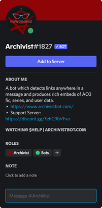

Today is the inaugural day for the Archivist Developer Blog. The purpose of this blog is for me to have a way to communicate certain longer form things about the bot and its development in a more concise way - but not quite as concise as Twitter. Posts will focus on both the development process and important information about updates. You can follow the blog through the RSS feed (linked on the top right navbar) if you have an RSS reader or similar service, but I'll also be sharing certain posts directly through Twitter and to the support server.

### Today's Bot Update ###
There's been a lot of Discord updates since the last time I was able to give Archivist some love, so over the last week I've been rolling out some small changes for the bot (and big changes for the website) at the same time I've been programming the update. Click the Read More to see more details.

<!--truncate-->

#### Discord Invite Integration ####
**The future addition of thread support and switch to slash commands** forced me to take a look at the permissions being requested by Archivist on invite and to see how the bot's needs had changed. 
This lead me to updating the invite links at both [top.gg](https://top.gg/bot/812505952959856690) and [DiscordBotList](https://discordbotlist.com/bots/archivist) and throughout the bot, as well as activated Discord's new app integrated invite system. <u>Now when you want to add Archivist to a new server you don't have to leave Discord.</u> You can simply hover over the bot to see its profile and click the `Add to Server` button.

But it also made me realize that users will need to change permissions or at least double check to make sure the correct ones had been added, or else **the updates would not work.** Because of this, you needed [a reference](/docs/Troubleshooting/permissions) - something easy to follow and read, and I didn't feel like the current website met those needs. With the list of commands growing longer, I felt organization was very important, and the current website made trying to organize things logically very difficult. That lead to...

#### The New Website ####
I'd been looking for solutions for the website for a long time. I was pretty sure I wanted to move to Github Pages, for ease of updating and because it would allow the community to begin to contribute directly if they wanted to. But I simply hadn't taken the leap - finding a site generator I liked and wanted to work with was difficult, but a friend finally suggested [Docusaurus](https://docusaurus.io/).

The benefits to using Docusaurus are pretty huge: responsive mobile design, light and dark mode accessibility, better designation and formatting for notes, tips, warnings, and other important information... and most importantly: more control over design, so that I could work with what was provided to meet our needs.

It's taken longer than I wanted to get it looking the way I wanted, but I've customized the base theme a lot. Now that the general design has been decided, it will be faster and easier to update and quicker to make tweaks to. And it's easily updatable by the community as no complicated languages are needed to update it. You only need a Github account, knowledge on how to submit a pull request (or a willingness to learn), and experience with Markdown - the very same language Discord uses to format your input.

#### Privacy Policy ####
The change to the website host made it necessary to update the Privacy Policy so that you had more information on what data Github was collecting and how they used it. The short is: Github logs visitor IPs for security purposes only. You can check out the disclosure in Archivist's [Privacy Policy](/privacy-policy) under *Types of Data Collected*. There is a link to Github's policy there.

#### Bot Growth ####
While I was working on all of these changes, I realized that the bot had reached the point that performance issues were likely, and though no one has complained yet, I wanted to get ahead of the potential problem. This update added sharding to the bot. Sharding splits different servers into different communication paths with Discord in order to prevent things from being overloaded. It's required once a bot hits 2500 servers, but recommended for 1000 or more. Hopefully we won't see any issues as the bot continues to grow.

#### What's Next ####
Next up for the bot is **slash commands**. I'll be posting a survey on how you'd rather me tackle this update on Twitter in the next few days, so be on the lookout for that. If you have any questions about slash commands or why the transition is happening, please feel free to ask on the support server!

After the slash commands update, there will be another full rewrite of Archivist. I still haven't decided what the best option is for me here, but I'll be making that decision in the next couple of months, so stay tuned.

I'll also be doing some thinking about how I want to handle community docs and coding contributions moving forward, and hope to have some news on that soon.